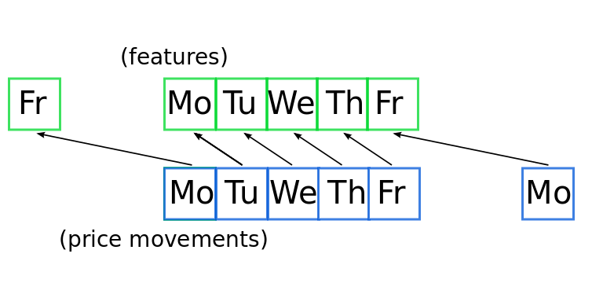
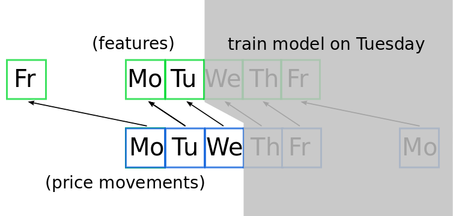

<!-- outline

who am I 
who uses backtests
what is a backtest
different kinds of backtests
why the problem is hard
different kinds of broken
  - time travel
  - single time series problems
  - corporate actions
  - 'bad' fill simulation

-->

<!-- notes for reveal: -->
<!-- zoom transition also good, but a little distracting -->
<!-- c.f.  
http://zevross.com/blog/2014/11/19/creating-elegant-html-presentations-that-feature-r-code/
http://stackoverflow.com/a/21468200/164611
https://github.com/hakimel/reveal.js/
https://j.eremy.net/align-lists-flush-left/
-->
 
## Who am I?

* Former applied mathematician. 
* Quant Programmer & Quant Strategist 2007-2015 at 
two small ML-based hedge funds.
* Almost pure quant funds, ML-based, in U.S. ("single name") equities and
volatility futures.
* Tried many approaches to finding alpha:
  * ML based like SVM, random forests, GP.
  * traditional techniques: plain old linear regression.
* Terrifying feeling of _"what am I doing here?"_
	* How do you write and validate and debug a backtest simulator?
  * No open source code available at the time.
  * Most academics probably write backtest code from scratch.
  * Papers with implicit backtests are _a priori_ suspect,
  moreso if the strategy is complex.

--- .class #backtests 

## Why backtest?

* What makes a profitable strategy?
  * Need prediction of future price movements.
* But also:
	* Turn the predictions into trades.
	* No, _really_. You need to **turn the predictions into trades**.
	* Eliminate or reduce exposure to certain risks.
	* Control trade costs. (market impact, commissions, short financing.)
* Hard to estimate the effects of the different moving parts separately.
* So simulate your trading historically: A _backtest._
* Backtesting basically implies _systematic_ strategies.
* Backtest to decide how much (if any) to deploy in a strategy.

--- .class #whatdo

## What do backtests do?

* A backtest probably should:
	* simulate environment in which you act (presents point-in-time data, accepts orders).
	* simulate the reactions of the world (fills, commissions, corporate actions,
	_etc_.).
	* translate in an obvious way to a real trading strategy.
	* provide a guarantee of _time safety_.
* Creating a good backtesting environment requires:
	* Software engineering: _balance_ **time safety**, **computational
efficiency** & **developer sanity**.
	* Domain knowledge and data: _How do corporate actions work?_ _How should you simulate fill?_
	* Great statistical powers: _How do you interpret the results?_ _How do you
	avoid overfitting?_
	* Good intuition and sleuthing abilities: _What new thing is broken?_

--- .class #kindsof

## Different kinds of backtests

--- .class #garbatrage

## Garbatrage

* Use Bayes' Rule:

  * Devising a consistently profitable trading strategy is known to be hard.  
  (The EMH posits that it is essentially _impossible_.)
  * Bugs are easy to make. A good programmer will make several a day.

* If your backtest looks profitable, what is the likelihood the
strategy is really profitable?
$$\mathcal{O}\left(\left.A\right|B\right) \propto \mathcal{O}\left(A\right)
\Lambda\left(\left.B\right|A\right).$$

* If you are exploring a new asset class, using a new fill simulator, 
using new code, testing a new strategy, or reading a paper, 
and the backtest looks great, _it's probably a bug_.

Examples:

* Paper from March 2012 that claimed Sharpe of 3.5 / sqrt(yr) and 500% 
annual returns using monthly trading with signal delayed a month. 
* Three day old tweets give you a Sharpe of around 9 / sqrt(yr) trading on the
DJIA index.

--- .class #timetravelzero

## Time Travel

* The most common error in backtests is _time travel_: use of future information 
in simulations.
* Time travel is easy to simulate, but hard to implement!
* Time travel occurs for many reasons:
  * Using crude tools.
	* Backfill and survivorship bias.
	* Representation of corporate actions: dividends, splits, spinoffs, mergers,
	warrants.
	* Think-os and code boo boos.

--- .class #survivorship

## Survivorship and Backfill

* Inclusion/exclusion of a company in data may be a form of time travel.
* A classic survivorship bias: trading historically on _today's_ S&P500 universe
of stocks.
* Similarly, data vendors often backfill data for companies.
  * You can test for this, or just ask them!
* Vendors (or you) do weird things to deal with mergers. 
* Takeaway: be careful with universe construction.

--- .class #corporate

## Corporate Actions 

* Corporate actions are notoriously time-leaky.
* Representing asset returns as a single time series: in reality, they
[branch across time](https://en.wikipedia.org/wiki/Citigroup).
* Corporate actions are just 
[hard to model](http://www.denisonmines.com/s/Corporate_History.asp).
* For example, (back) adjusted closes. A portfolio inversely proportional to
adjusted close has time-travel 'arb'.

--- .class #mlhackerone

## The ML Hacker Trap

* Align returns to features for training ML models.
* Forget that the model is timestamped to the _returns_.
* A warning: _the more often I retrain, the better
my model!_  
(Often with an excuse for 'time freshness'.)

--- .class #mlhackertwo

## The ML Hacker Trap

* Align returns to features for training ML models.
* Forget that the model is timestamped to the _returns_.
* A warning: _the more often I retrain, the better
my model!_  
(Often with an excuse for 'time freshness'.)

--- .class #fill

## Broken Fill Simulation

* In reality, orders might not get (fully) filled, or might get a bad price.
* Hard to simulate given coarse data, like daily bars.
* There is 'market impact' where your order affects your fill price.
  * Bigger orders lead to bigger impact.
  * Decent theoretical models but with uncertain parameters.
  * Fitting the parameters is tricky--you only observe one history.
  * Impact models often ignore other factors (like the Market).
* Fill simulation should introduce a _large_ band of uncertainty
around your simulations.

* You do not 

--- .class #ohno

## Overfitting?

--- .class #overfitting

## Overfitting

* Two forms of overfitting:
  * Having an overly optimistic estimate of out-of-sample performance.
  * Choosing a suboptimal strategy by having too much freedom.
* Two forms or one form?

--- .class #eafters

## Biased Estimates

* First kind of overfitting is like 'estimation after selection'.
* For example:
  * generate 1000 'random' strategies,
  * backtest them all,
  * pick best one based on maximal in-sample Sharpe,
  * estimate the out-of-sample Sharpe of that strategy?
* But not entirely a technical problem.
* Usually attacked by elaborate '_in-sample_' vs. '_out-of-sample_' schemes.
* In reality, there is '_in-sample_' and '_trading-real-money_.'
  * You ignore data available to you now at your own risk.

--- .class #suboptimal

## Suboptimal Models

* The classical overfit problem: too many parameters causes 
poor live performance.

* Applies to portfolio optimization in a subtle way.
* "_A perfectly rational agent should not be harmed by addition of choices._"
* **There are no perfectly rational systematic strategies.**

--- .class #conclusions

## Parting Words

* Sorry, but you probably have to write your own backtester.
* Backtests are often broken.
* You should be suspect of all results based on backtests,
including your own.
* The best way to find errors in your backtester is to use
it a lot.
* Making systematic strategies is _not_ just a software
engineering challenge.
* Good luck!

